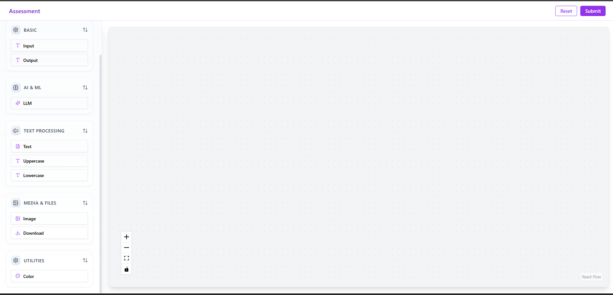

## Features Completed

Abstracted all node types using `NodeBase`  
Created 9 unique nodes (Input, Ouput, LLM, Text, Image, Color, Uppercase, Lowercase, Download)  
Styled all components with modern UI/UX  
Implemented TextNode with dynamic textarea + input handles  
Integrated with FastAPI backend  
Submit button triggers DAG analysis with real-time feedback

## Getting Started

### Frontend
```bash
cd frontend
npm install
npm start

```

### Submitting Pipeline

Click Submit Pipeline button → triggers POST /pipelines/parse and shows:
    1. Number of nodes
    2. Number of edges
    3. Whether pipeline is a DAG

### Backend
 ```
cd backend
uvicorn main:app --reload

```

